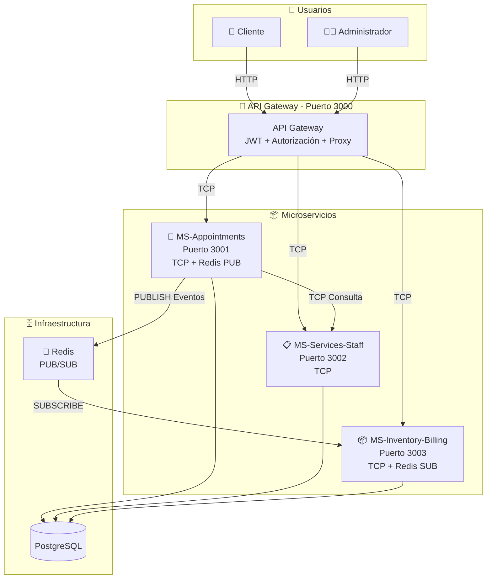
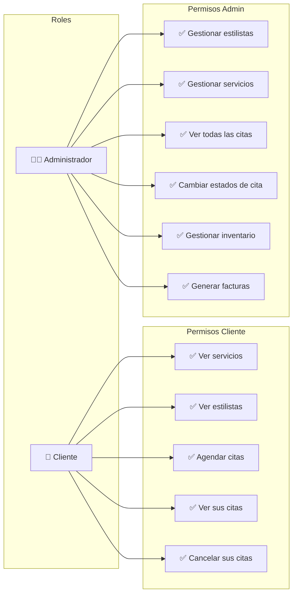
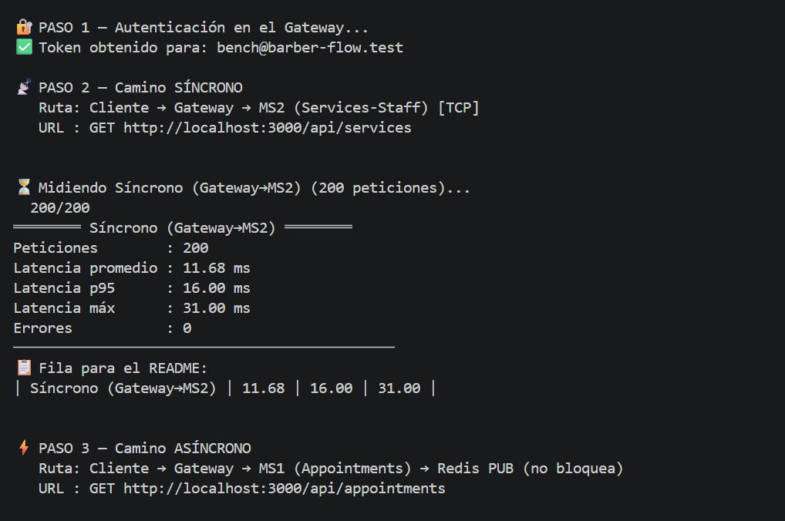
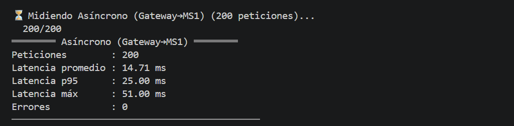
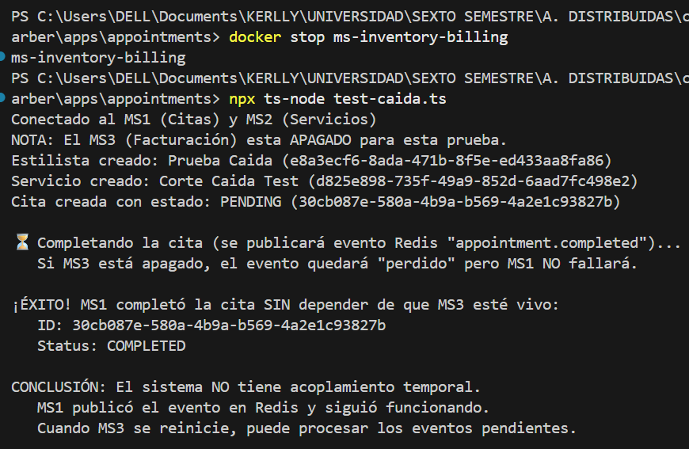
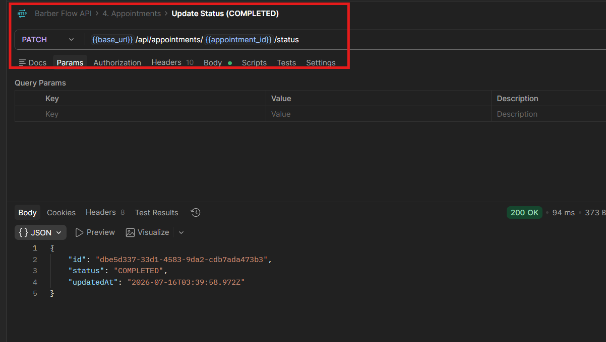
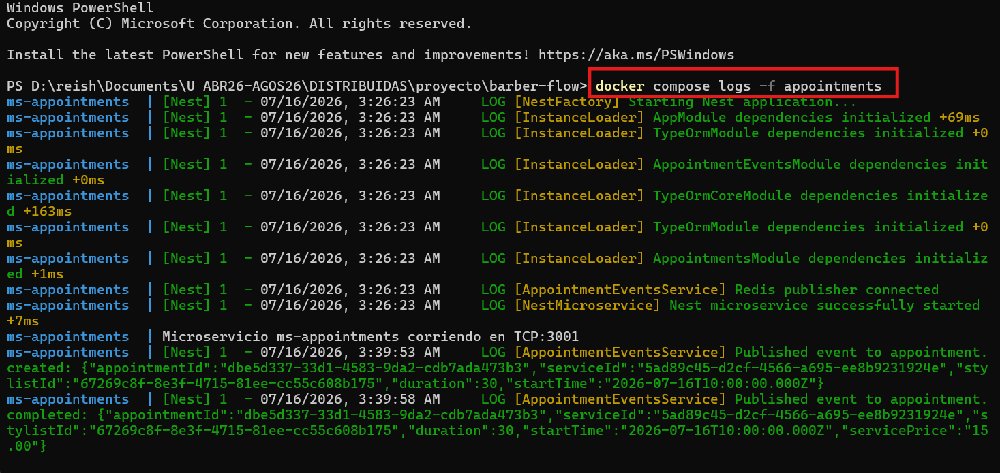
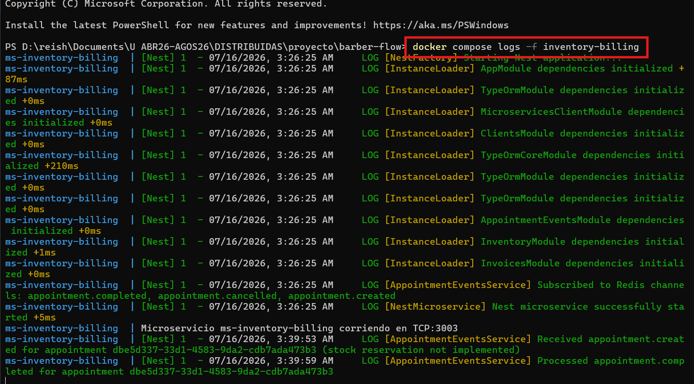

# BARBER - FLOW

> MVP de arquitectura de microservicios · Aplicaciones Distribuidas · 7.° semestre · Entrega por avances.

## 👥 Equipo
| Integrante | Rol | GitHub |
|---|---|---|
| Daniel Guaman | Documentación / Seguridad | @AlexDaniel593 |
| Javier Jaguaco | Transporte / Backend | @JonathanJQ03 |
| Reishel Tipan | Transporte / Backend | @Reishel-Tipan |
| Kerly Chiroboga | Backend / QA | @k0c0h |

## 🧩 Descripción del MVP

**BARBER-FLOW** es un sistema de gestión y reservas para peluquerías diseñado para optimizar la administración de citas, estilistas, servicios e inventario. El MVP se enfoca en demostrar los principios de arquitectura de microservicios, utilizando un dominio sencillo pero funcional que permite agendar citas, gestionar el catálogo de servicios y estilistas, y controlar el inventario con facturación automática.

El dominio se mantiene deliberadamente simple para centrar el esfuerzo en la **comunicación entre microservicios**, el **manejo de latencia**, el **acoplamiento temporal** y las **buenas prácticas de desarrollo** como SOLID, patrones de diseño y manejo de excepciones. El sistema cuenta con dos roles de usuario: **Cliente** (puede agendar y consultar sus citas) y **Administrador** (gestiona estilistas, servicios, inventario y facturación).

---

### 📦 Microservicios

- **MS 1 — Gestión de Citas (Appointments):**  
  Responsable de la lógica central de reservas. Maneja el CRUD de citas, verifica disponibilidad de horarios (evitando overlapping), controla los estados de la cita (Pendiente, Confirmada, En Proceso, Completada, Cancelada, No Asistió) y publica eventos en Redis cuando una cita cambia de estado (ej. `appointment.completed`). Se comunica vía TCP con el Gateway y con MS 2 para validar estilistas y servicios.

- **MS 2 — Servicios y Personal (Services & Staff):**  
  Administra el catálogo de la peluquería. Gestiona el CRUD de **estilistas** (nombre, especialidades, horario laboral) y **servicios** (nombre, precio, duración, categoría). Mantiene la relación Many-to-Many entre estilistas y servicios, permitiendo asignar qué profesionales están capacitados para realizar cada servicio. Solo utiliza comunicación síncrona (TCP).

- **MS 3 — Inventario y Facturación (Inventory & Billing):**  
  Controla los insumos profesionales y productos de venta al público (retail). Gestiona el stock de productos, genera alertas de stock bajo y descuenta automáticamente del inventario cuando una cita se completa (escuchando eventos de Redis como `appointment.completed`). También genera facturas asociadas a cada cita, calculando el total a pagar (servicio + productos adicionales) y permite consultar resúmenes diarios y mensuales de ventas.

- **API Gateway:**  
  Punto único de entrada para los clientes (HTTP en puerto 3000). Implementa autenticación con JWT, autorización por roles (`client` y `admin`), y actúa como proxy enrutando las peticiones a los microservicios correspondientes mediante TCP. Centraliza la lógica de seguridad y simplifica la interacción con el sistema.

---

### 🎯 Objetivo del MVP

El objetivo principal es **demostrar el funcionamiento de una arquitectura de microservicios** en un escenario real, abordando:

- **Comunicación síncrona (TCP):** Gateway → MS 1 → MS 2 para validaciones en tiempo real.
- **Comunicación asíncrona (Redis):** MS 1 → Redis → MS 3 para desacoplar procesos como consumo de inventario y facturación.
- **Acoplamiento temporal:** Evidenciar cómo una falla en un servicio síncrono afecta toda la cadena, mientras que el flujo asíncrono continúa funcionando.
- **Medición de latencia:** Comparar los tiempos de respuesta entre el camino síncrono y el asíncrono.

## 🛠️ Stack Tecnológico

### Backend

| Capa | Tecnología | Propósito |
|------|------------|-----------|
| **Framework** | NestJS | Framework principal para todos los microservicios y API Gateway |
| **Lenguaje** | TypeScript | Tipado estático y mejores prácticas de desarrollo |
| **ORM** | Prisma | Manejo de base de datos, migrations y queries tipadas |
| **Base de Datos** | PostgreSQL | Base de datos relacional para persistencia de datos |

---

### Comunicación entre Microservicios

| Tipo | Tecnología | Propósito |
|------|------------|-----------|
| **Síncrono** | TCP (NestJS Microservices) | Comunicación petición-respuesta entre microservicios |
| **Eventos Asíncronos** | Redis (PUB/SUB) | Desacoplamiento temporal y manejo de eventos |
| **gRPC** *(Tarea 2)* | gRPC + Protocol Buffers | Comunicación con contrato definido y alta performance |
| **Segundo Transporte** *(Tarea 2)* | RabbitMQ / MQTT / NATS | Balanceo de carga y colas de mensajes |

---

### Seguridad y Observabilidad

| Capa | Tecnología | Propósito |
|------|------------|-----------|
| **Autenticación** | JWT (JSON Web Tokens) | Generación y validación de tokens de acceso |
| **Autorización** | Guards + Roles | Protección de endpoints según rol (`client` / `admin`) |
| **Manejo de Errores** | Exception Filters | Captura y respuesta consistente de errores |
| **Observabilidad** | Sentry | Logs, monitoreo y seguimiento de errores en producción |

---

### Infraestructura

| Capa | Tecnología | Propósito |
|------|------------|-----------|
| **Contenedores** | Docker | Empaquetado de cada microservicio |
| **Orquestación** | Docker Compose | Levantar todos los servicios con un solo comando |
| **Base de Datos** | PostgreSQL | Almacenamiento persistente (contenedorizado) |
| **Cache / Broker** | Redis | PUB/SUB para eventos asíncronos |

---

### Estructura del Proyecto

| Tipo | Descripción |
|------|-------------|
| **Monorepo** | Un único repositorio que contiene cada microservicio en carpetas independientes, manteniendo total autonomía de desarrollo, tecnologías y despliegue. |
| **Docker Compose** | Orquestación de todos los servicios en desarrollo local |

---


## ▶️ Cómo ejecutar
```bash
docker compose up -d --build
docker compose ps
curl http://localhost:3000/api/<<recurso>>
```

## 🏗️ Arquitectura

### Visión General del Sistema

El sistema está compuesto por **3 microservicios** + **1 API Gateway**, comunicándose mediante **TCP** (síncrono) y **Redis** (asíncrono). Cada microservicio tiene una responsabilidad única y utiliza **PostgreSQL** como base de datos.



### Roles y Permisos



## 🧭 Metodología
- **Kanban:** [GitHub Projects](https://github.com/users/AlexDaniel593/projects/1/views/1) (captura en /docs).
- **Ramificación:** <<GitHub Flow>> — `main` protegida, ramas `feat/…`, PRs revisados, tags por avance.
- **Commits semánticos:** Conventional Commits.

## 🧩 Patrones y principios aplicados

| Patrón / Principio | Descripción | Dónde se aplica |
|---|---|---|
| **API Gateway** | Punto único de entrada HTTP con JWT y roles |  |
| **Publisher/Subscriber** | MS1 publica eventos, MS3 los consume sin acoplamiento | Redis PUB/SUB |
| **Repository Pattern** | TypeORM repositories encapsulan acceso a datos | Todos los microservicios |
| **DTO + Pipes (SRP)** | Separación de responsabilidades: validación en DTOs | `appointments/src/dto/, inventory-system/src/dto, services-staff/src/dto` |
| **Exception Filters** | Manejo consistente de errores en handlers TCP | `try/catch` en servicios |
| **DIP** | Los servicios dependen de abstracciones (interfaces) de NestJS | `@Injectable()` |


---
## 🟢 Avance 1 — Acoplamiento temporal y latencia · `tag v1-avance1`

### Caminos

- **Síncrono (TCP):** `MS1-Appointments` → `MS2-Services-Staff` (validación de estilista y servicio al crear cita).
- **Asíncrono (Redis):** `MS1-Appointments` publica evento `appointment.completed` → `MS3-Inventory-Billing` genera factura sin bloquear al emisor.

### 📈 Latencia (con `benchmark-latency.js`)

| Camino | Promedio (ms) | p95 (ms) | Máx (ms) |
|---|---|---|---|
| Síncrono (Gateway → MS2) | 11.68 | 16.00 | 31.00 |
| Asíncrono (Gateway → MS1) | 14.71 | 25.00 | 51.00 |

## Evidencia de benchmark de latencia




### 🔌 Acoplamiento temporal — Prueba de caída

**Escenario:** Se apagó el microservicio MS3 (`docker stop ms-inventory-billing`) y se intentó completar una cita.
**Resultado:** MS1 completó la cita exitosamente y publicó el evento en Redis sin ningún error, demostrando que **no existe acoplamiento temporal** en el camino asíncrono.

```bash
docker stop ms-inventory-billing
npx ts-node test-caida.ts
```

## Evidencia de acoplamiento temporal


**Conclusión:** El modelo asíncrono con Redis desacopla temporalmente los servicios. MS1 puede operar con normalidad aunque MS3 esté caído. Cuando MS3 se reinicia, el sistema continúa funcionando normalmente.

### 📡 Camino asíncrono — Redis (evento, el emisor no bloquea)

Para comprobar que MS1 no queda a la espera de MS3, se levantó el sistema completo con `docker compose up -d --build` y se ejecutó el flujo real vía Postman: registro/login → creación de estilista → creación de servicio → creación de cita → cambio de estado a `COMPLETED`.

Ese último paso (`PATCH /api/appointments/{id}/status`) es el que dispara el evento `appointment.completed` hacia Redis. La petición respondió `200 OK` en **94 ms**, tiempo que corresponde únicamente a guardar el nuevo estado en la base de datos y confirmar la publicación en el canal de Redis — no incluye el procesamiento posterior de inventario ni de la factura.



En los logs de contenedores se ve el mismo comportamiento: `ms-appointments` publica el evento y sigue con su ejecución de inmediato, mientras que `ms-inventory-billing` recién termina de procesarlo un segundo después.





```
ms-appointments        3:39:58 AM  Published event to appointment.completed: {...}
ms-inventory-billing   3:39:59 AM  Processed appointment.completed for appointment dbe5d337-...
```

**Análisis:** MS1 usa el cliente `redis` para publicar en el canal (`this.publisher.publish(channel, message)`), una operación que solo espera la confirmación de Redis de que el mensaje entró al canal — no espera a que exista o termine ningún consumidor. Por eso Postman recibe la respuesta casi de inmediato (94 ms) aun cuando MS3 tarda más en descontar stock y armar la factura. El log de `inventory-billing` aparece un segundo después del de `appointments`, con el mismo `appointmentId`, lo que confirma que ambos servicios procesaron el mismo evento de forma independiente y sin bloquearse entre sí.

### 🧠 Análisis
- **Acumulación de latencia:** En el camino síncrono, los tiempos de respuesta se acumulan debido a que cada salto en la cadena (Gateway → MS1 → MS2) requiere realizar una petición y esperar su respuesta de forma secuencial. La latencia total experimentada por el cliente es la suma directa del procesamiento y el tránsito de red de todos los servicios involucrados.
- **Acoplamiento temporal:** En una cadena síncrona, todos los servicios deben estar levantados y disponibles al mismo tiempo. Si uno de ellos falla (acoplamiento temporal fuerte), toda la operación falla. Con el camino asíncrono mediado por Redis (PUB/SUB), el servicio emisor (MS1) publica el evento de confirmación de cita inmediatamente en Redis sin bloquearse ni esperar al receptor (MS3). Esto permite que el cliente reciba una respuesta rápida e independiente del estado de MS3. Si MS3 está apagado, la cita se registra y completa exitosamente de todas formas, y cuando MS3 vuelve a estar en línea, procesa el evento pendiente para generar la factura de manera diferida.


---

## 🟡 Avance 2 — Comunicación: gRPC + 2.º transporte + excepciones · `tag v2-avance2`
### gRPC (contrato + monorepo)
✍️ <<Contrato `.proto` y comunicación gRPC entre <<A>> y <<B>>. Control de errores con try/catch.>>

### Segundo transporte
✍️ <<Transporte elegido (<<RabbitMQ/MQTT/NATS>>) y flujo PUB/SUB o queue implementado.>>

### 🔁 Comparación de transportes
| Transporte | Tipo | Patrón | Uso en el proyecto |
|---|---|---|---|
| TCP | Síncrono | Petición-respuesta | << >> |
| Redis | Asíncrono | PUB/SUB | << >> |
| <<RabbitMQ/MQTT/NATS>> | Asíncrono | <<PUB/SUB o queue>> | << >> |
| gRPC | Síncrono | Contrato/RPC | << >> |

✍️ <<1 párrafo: cuándo conviene cada uno.>>

### 🧯 Manejo de excepciones
✍️ <<Qué errores se controlan y cómo (evidencia de un error que no tumba el servicio).>>

---

## 🔵 Avance 3 — Seguridad, observabilidad e integración (FINAL) · `tag v3-final`
### 🔐 Autenticación y autorización
✍️ <<Login que emite JWT; Guard que protege rutas. Evidencia: 200 con token, 401 sin token (y 403 por rol si aplica).>>

### 📊 Observabilidad (Sentry)
✍️ <<Qué se registra; captura del error en el panel de Sentry.>>

### 🔗 Integración final
✍️ <<Operación que atraviesa varios microservicios/transportes desde el Gateway.>>

### 🏗️ Diagrama final
✍️ <<Sistema integrado>>

---

## 🎤 Defensa
✍️ <<Enlace a diapositivas + guion. Runbook de la demo (levantar → login → ruta protegida → operación integrada → error en Sentry). Preguntas frecuentes preparadas.>>

## 🏷️ Tags de entrega
- `v1-avance1` — 15-07-2026 · `v2-avance2` — 18-07-2026 · `v3-final` — 22-07-2026
