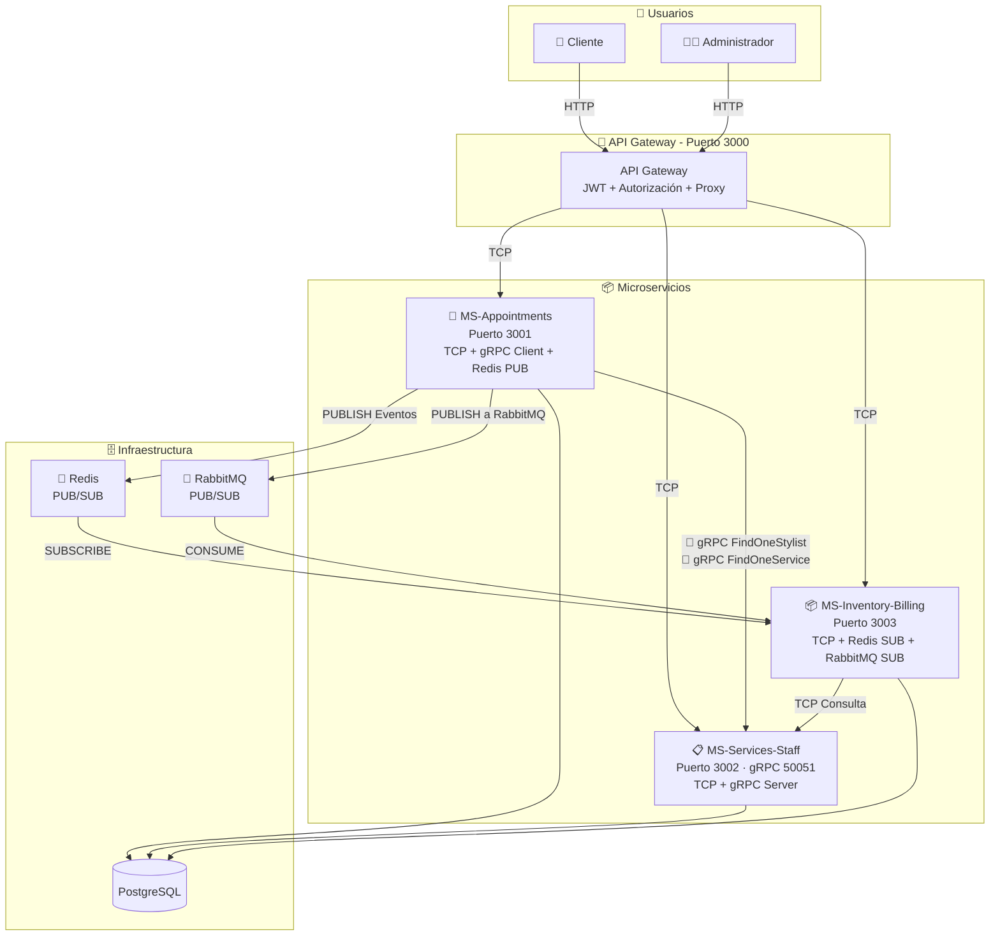
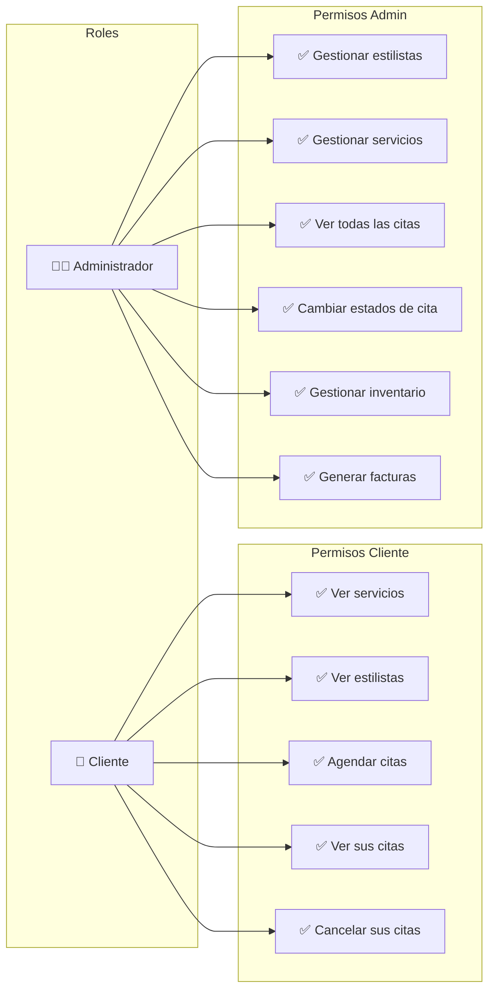
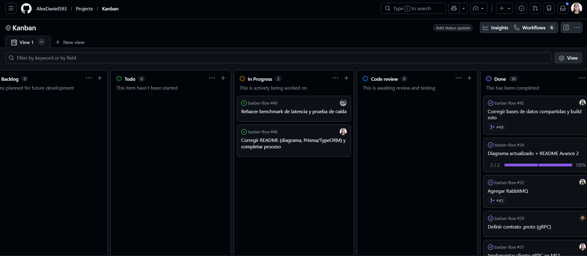
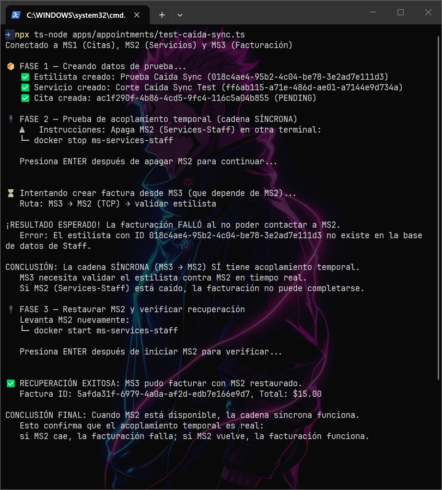
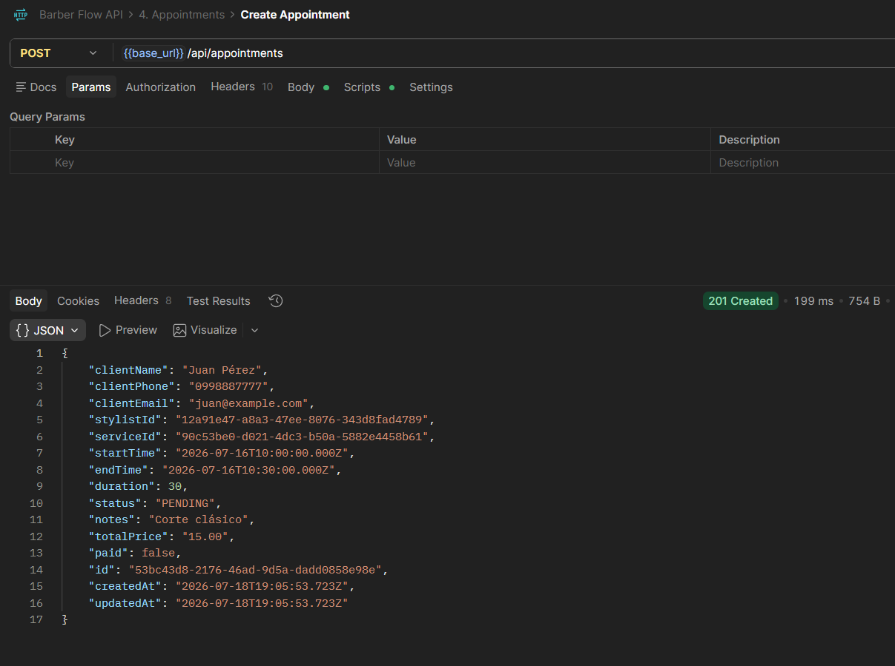
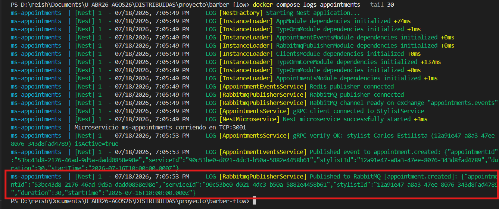
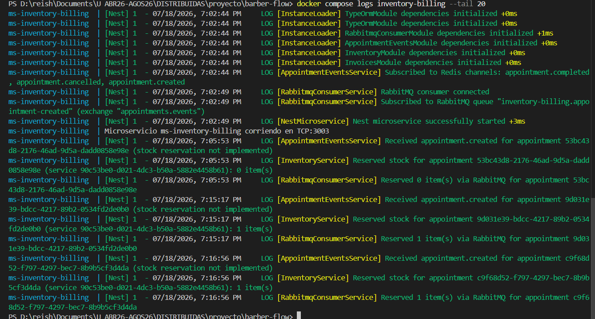
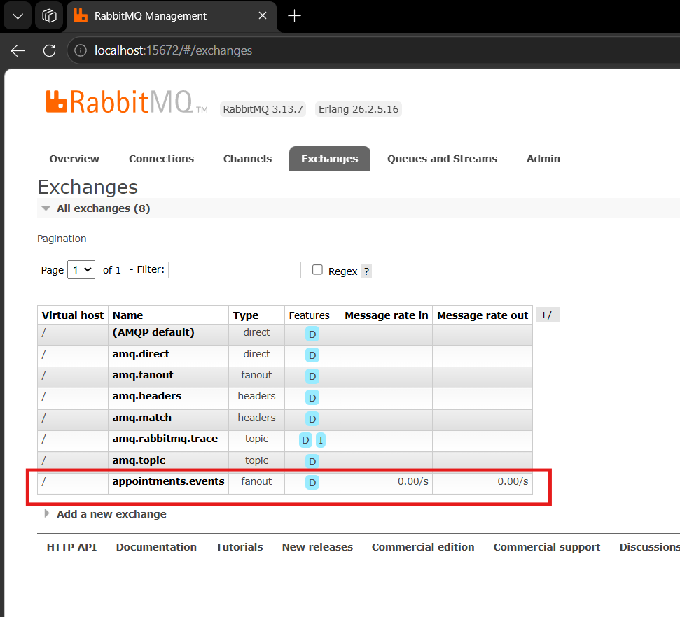
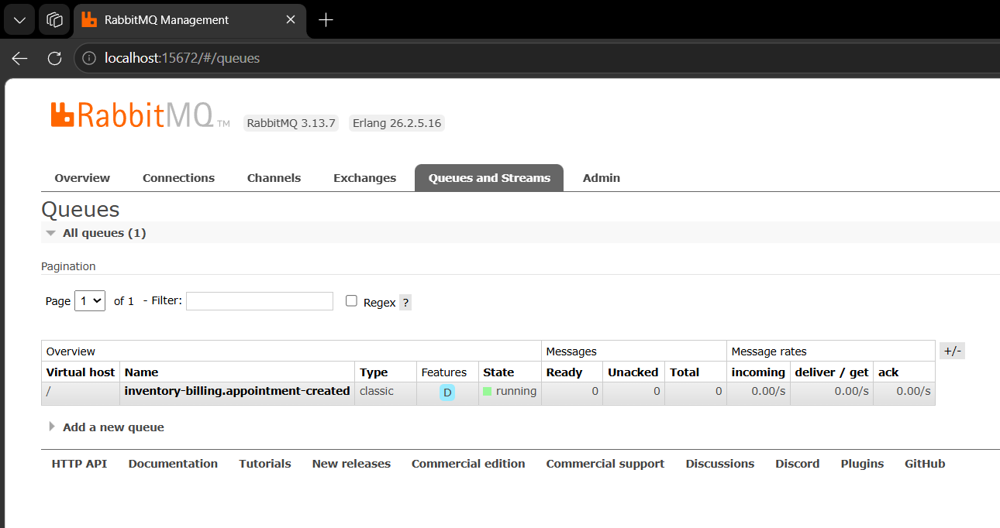

# BARBER - FLOW

> MVP de arquitectura de microservicios · Aplicaciones Distribuidas · 7.° semestre · Entrega por avances.

## 👥 Equipo
| Integrante | Rol | GitHub |
|---|---|---|
| Daniel Guaman | Documentación / Seguridad | @AlexDaniel593 |
| Javier Jaguaco | Transporte / Backend | @JonathanJQ03 |
| Reishel Tipan | Transporte / Backend | @Reishel-Tipan |
| Kerly Chiroboga | Backend / QA | @k0c0h |

## 🧩 Descripción del MVP

**BARBER-FLOW** es un sistema de gestión y reservas para peluquerías diseñado para optimizar la administración de citas, estilistas, servicios e inventario. El MVP se enfoca en demostrar los principios de arquitectura de microservicios, utilizando un dominio sencillo pero funcional que permite agendar citas, gestionar el catálogo de servicios y estilistas, y controlar el inventario con facturación automática.

El dominio se mantiene deliberadamente simple para centrar el esfuerzo en la **comunicación entre microservicios**, el **manejo de latencia**, el **acoplamiento temporal** y las **buenas prácticas de desarrollo** como SOLID, patrones de diseño y manejo de excepciones. El sistema cuenta con dos roles de usuario: **Cliente** (puede agendar y consultar sus citas) y **Administrador** (gestiona estilistas, servicios, inventario y facturación).

---

### 📦 Microservicios

- **MS 1 — Gestión de Citas (Appointments):**  
  Responsable de la lógica central de reservas. Maneja el CRUD de citas, verifica disponibilidad de horarios (evitando overlapping), controla los estados de la cita (Pendiente, Confirmada, En Proceso, Completada, Cancelada, No Asistió) y publica eventos en Redis cuando una cita cambia de estado (ej. `appointment.completed`). Se comunica vía TCP con el Gateway y con MS 2 para validar estilistas y servicios.

- **MS 2 — Servicios y Personal (Services & Staff):**  
  Administra el catálogo de la peluquería. Gestiona el CRUD de **estilistas** (nombre, especialidades, horario laboral) y **servicios** (nombre, precio, duración, categoría). Mantiene la relación Many-to-Many entre estilistas y servicios, permitiendo asignar qué profesionales están capacitados para realizar cada servicio. Solo utiliza comunicación síncrona (TCP).

- **MS 3 — Inventario y Facturación (Inventory & Billing):**  
  Controla los insumos profesionales y productos de venta al público (retail). Gestiona el stock de productos, genera alertas de stock bajo y descuenta automáticamente del inventario cuando una cita se completa (escuchando eventos de Redis como `appointment.completed`). También genera facturas asociadas a cada cita, calculando el total a pagar (servicio + productos adicionales) y permite consultar resúmenes diarios y mensuales de ventas.

- **API Gateway:**  
  Punto único de entrada para los clientes (HTTP en puerto 3000). Implementa autenticación con JWT, autorización por roles (`client` y `admin`), y actúa como proxy enrutando las peticiones a los microservicios correspondientes mediante TCP. Centraliza la lógica de seguridad y simplifica la interacción con el sistema.

---

### 🎯 Objetivo del MVP

El objetivo principal es **demostrar el funcionamiento de una arquitectura de microservicios** en un escenario real, abordando:

- **Comunicación síncrona (TCP):** Gateway → MS 1 → MS 2 para validaciones en tiempo real.
- **Comunicación asíncrona (Redis):** MS 1 → Redis → MS 3 para desacoplar procesos como consumo de inventario y facturación.
- **Acoplamiento temporal:** Evidenciar cómo una falla en un servicio síncrono afecta toda la cadena, mientras que el flujo asíncrono continúa funcionando.
- **Medición de latencia:** Comparar los tiempos de respuesta entre el camino síncrono y el asíncrono.

## 🛠️ Stack Tecnológico

### Backend

| Capa | Tecnología | Propósito |
|------|------------|-----------|
| **Framework** | NestJS | Framework principal para todos los microservicios y API Gateway |
| **Lenguaje** | TypeScript | Tipado estático y mejores prácticas de desarrollo |
| **ORM** | TypeORM | Manejo de base de datos, migrations y queries tipadas |
| **Base de Datos** | PostgreSQL | Base de datos relacional para persistencia de datos |

---

### Comunicación entre Microservicios

| Tipo | Tecnología | Propósito |
|------|------------|-----------|
| **Síncrono** | TCP (NestJS Microservices) | Comunicación petición-respuesta entre microservicios |
| **Eventos Asíncronos** | Redis (PUB/SUB) | Desacoplamiento temporal y manejo de eventos |
| **gRPC** | gRPC + Protocol Buffers | Comunicación con contrato definido (`apps/proto/barber.proto`) entre MS1 y MS2 |
| **Segundo Transporte** | RabbitMQ (PUB/SUB) | Reserva de inventario al crear una cita, desacoplada de MS1 |

---

### Seguridad y Observabilidad

| Capa | Tecnología | Propósito |
|------|------------|-----------|
| **Autenticación** | JWT (JSON Web Tokens) | Generación y validación de tokens de acceso |
| **Autorización** | Guards + Roles | Protección de endpoints según rol (`client` / `admin`) |
| **Manejo de Errores** | Exception Filters | Captura y respuesta consistente de errores |
| **Observabilidad** | Sentry | Logs, monitoreo y seguimiento de errores en producción |

---

### Infraestructura

| Capa | Tecnología | Propósito |
|------|------------|-----------|
| **Contenedores** | Docker | Empaquetado de cada microservicio |
| **Orquestación** | Docker Compose | Levantar todos los servicios con un solo comando |
| **Base de Datos** | PostgreSQL | Almacenamiento persistente (contenedorizado) |
| **Cache / Broker** | Redis | PUB/SUB para eventos asíncronos |

---

### Estructura del Proyecto

| Tipo | Descripción |
|------|-------------|
| **Monorepo** | Un único repositorio que contiene cada microservicio en carpetas independientes, manteniendo total autonomía de desarrollo, tecnologías y despliegue. |
| **Docker Compose** | Orquestación de todos los servicios en desarrollo local |

---


## ▶️ Cómo ejecutar
```bash
docker compose up -d --build
docker compose ps
curl http://localhost:3000/api/<<recurso>>
```

## 🏗️ Arquitectura

### Visión General del Sistema

El sistema está compuesto por **3 microservicios** + **1 API Gateway**, comunicándose mediante **TCP** (síncrono), **Redis** (asíncrono), **gRPC** (contrato) y **RabbitMQ** (PUB/SUB). Cada microservicio tiene una responsabilidad única y utiliza **PostgreSQL** como base de datos.



### Roles y Permisos



## 🧭 Metodología
- **Kanban:** [GitHub Projects](https://github.com/users/AlexDaniel593/projects/1/views/1)
  
- **Ramificación:** <<GitHub Flow>> — `main` protegida, ramas `feat/…`, PRs revisados, tags por avance.
- **Commits semánticos:** Conventional Commits.

## 🧩 Patrones y principios aplicados

| Patrón / Principio | Descripción | Dónde se aplica |
|---|---|---|
| **API Gateway** | Punto único de entrada HTTP con JWT y roles |  |
| **Publisher/Subscriber** | MS1 publica eventos, MS3 los consume sin acoplamiento | Redis PUB/SUB (Avance 1) y RabbitMQ PUB/SUB (Avance 2) |
| **Repository Pattern** | TypeORM repositories encapsulan acceso a datos | Todos los microservicios |
| **DTO + Pipes (SRP)** | Separación de responsabilidades: validación en DTOs | `appointments/src/dto/, inventory-system/src/dto, services-staff/src/dto` |
| **Exception Filters** | Manejo consistente de errores en handlers TCP | `try/catch` en servicios |
| **DIP** | Los servicios dependen de abstracciones (interfaces) de NestJS | `@Injectable()` |
| **Contrato/RPC (gRPC)** | Comunicación tipada mediante `.proto` compartido en el monorepo | `apps/proto/barber.proto`, MS1 (cliente) y MS2 (servidor) |
| **Adapter** | Los servicios `RabbitmqPublisherService`/`RabbitmqConsumerService` envuelven la librería `amqplib` detrás de una interfaz simple (`publish`, `handleMessage`) | MS1 y MS3 |


---
## 🟢 Avance 1 — Acoplamiento temporal y latencia · `tag v1-avance1`

### Caminos

| # | Camino | Tipo | Saltos TCP | Gatillado por |
|---|--------|------|:----------:|---------------|
| 1 | `Gateway` → `MS2-Services-Staff` | Síncrono | 1 | `GET /api/services` |
| 2 | `Gateway` → `MS1-Appointments` → Redis (PUB `appointment.completed`) | Asíncrono (evento genuino) | 1 | `PATCH /api/appointments/{id}/status` → `COMPLETED` |
| 3 | `Gateway` → `MS3-Inventory-Billing` → `MS2-Services-Staff` | Síncrono (cadena de facturación) | 2 | `POST /api/invoices` |

### 📈 Latencia (con `benchmark-latency.js`)

| Camino | Promedio (ms) | p95 (ms) | Máx (ms) |
|---|---|---|---|
| Síncrono (Gateway→MS2) | 5.86 | 7.00 | 9.00 |
| Completar cita (Gateway→MS1→Redis) | 11.97 | 15.00 | 26.00 |
| Facturación (Gateway→MS3→MS2) | 13.79 | 18.00 | 25.00 |

## Evidencia de benchmark de latencia


### 🔌 Acoplamiento temporal — Pruebas de caída

#### Escenario A: Camino asíncrono (Redis) — Sin acoplamiento temporal

**Procedimiento:** Se apaga MS3 (`docker stop ms-inventory-billing`) y se completa una cita.

```bash
docker stop ms-inventory-billing
npx ts-node test-caida.ts
```

**Resultado:** MS1 completó la cita exitosamente y publicó el evento `appointment.completed` en Redis sin errores. El camino asíncrono **no se bloquea** aunque el consumidor (MS3) esté caído.

**Conclusión:** El canal asíncrono con Redis desacopla temporalmente al emisor (MS1) del receptor (MS3). MS1 solo espera la confirmación de Redis de que el mensaje entró al canal, sin importar si hay un suscriptor activo.

#### Escenario B: Cadena síncrona de facturación — SÍ hay acoplamiento temporal

**Procedimiento:** Con MS2 encendido se crean los datos de prueba (estilista, servicio, cita). Luego se apaga MS2 (`docker stop ms-services-staff`) y se intenta crear una factura.

```bash
docker stop ms-services-staff
npx ts-node test-caida-sync.ts
```

**Resultado:** MS3 (Inventory-Billing) intenta validar el estilista llamando a MS2 por TCP (`invoices.service.ts:30-33`) y encuentra la conexión rechazada (`ECONNREFUSED`). La excepción se captura en `invoices.service.ts:34-50` y se lanza un `RpcException` con el mensaje: *"Servicio de Staff no disponible. No se puede validar el estilista. Intente más tarde."* La facturación **falla**.

```text
Error: Servicio de Staff no disponible. No se puede validar el estilista. Intente más tarde.
```

**Conclusión:** La cadena síncrona de facturación (MS3 → MS2) SÍ tiene **acoplamiento temporal fuerte**. Si MS2 (Services-Staff) está caído, MS3 no puede validar el estilista y la factura no se genera. Cuando MS2 se reinicia, la operación se recupera automáticamente.

## Evidencia de acoplamiento temporal



### 📡 Camino asíncrono — Redis (evento, el emisor no bloquea)

Para comprobar que MS1 no queda a la espera de MS3, se levantó el sistema completo con `docker compose up -d --build` y se ejecutó el flujo real vía Postman: registro/login → creación de estilista → creación de servicio → creación de cita → cambio de estado a `COMPLETED`.

Ese último paso (`PATCH /api/appointments/{id}/status`) es el que dispara el evento `appointment.completed` hacia Redis. La petición respondió `200 OK` en **94 ms**, tiempo que corresponde únicamente a guardar el nuevo estado en la base de datos y confirmar la publicación en el canal de Redis — no incluye el procesamiento posterior de inventario ni de la factura.


En los logs de contenedores se ve el mismo comportamiento: `ms-appointments` publica el evento y sigue con su ejecución de inmediato, mientras que `ms-inventory-billing` recién termina de procesarlo un segundo después.


```
ms-appointments        3:39:58 AM  Published event to appointment.completed: {...}
ms-inventory-billing   3:39:59 AM  Processed appointment.completed for appointment dbe5d337-...
```

**Análisis:** MS1 usa el cliente `redis` para publicar en el canal (`this.publisher.publish(channel, message)`), una operación que solo espera la confirmación de Redis de que el mensaje entró al canal — no espera a que exista o termine ningún consumidor. Por eso Postman recibe la respuesta casi de inmediato (94 ms) aun cuando MS3 tarda más en descontar stock y armar la factura. El log de `inventory-billing` aparece un segundo después del de `appointments`, con el mismo `appointmentId`, lo que confirma que ambos servicios procesaron el mismo evento de forma independiente y sin bloquearse entre sí.

### 🧠 Análisis
- **Acumulación de latencia:** En los caminos síncronos, los tiempos de respuesta se acumulan con cada salto en la cadena. La medición lo confirma:
  - `1 salto TCP` (Gateway→MS2): latencia más baja (~11 ms promedio)
  - `1 salto TCP + Redis PUB` (Gateway→MS1→Redis): latencia intermedia (~14 ms) — incluye la escritura en Redis
  - `2 saltos TCP` (Gateway→MS3→MS2): latencia más alta (~18 ms) — suma del procesamiento de MS3 más la validación contra MS2
- **Acoplamiento temporal — evidencia contrastada:**
  - **Camino asíncrono (Redis):** MS1 publica el evento `appointment.completed` en Redis sin esperar a que MS3 lo consuma. Si MS3 está caído, la cita se completa igual. **No hay acoplamiento temporal.** El emisor no depende de la disponibilidad del receptor.
  - **Cadena síncrona de facturación (MS3 → MS2):** MS3 necesita validar el estilista contra MS2 en tiempo real (`invoices.service.ts:30-33`). Si MS2 está caído, la conexión TCP se rechaza (`ECONNREFUSED`) y la factura no se genera. **Sí hay acoplamiento temporal.** Todos los servicios de la cadena deben estar levantados simultáneamente para que la operación complete.


---

## 🟡 Avance 2 — Comunicación: gRPC + 2.º transporte + excepciones · `tag v2-avance2`

### gRPC (contrato + monorepo)

Se definió un contrato compartido en `apps/proto/barber.proto`, usado tanto por `MS2-Services-Staff` (servidor) como por `MS1-Appointments` (cliente), dentro del mismo monorepo:

```proto
syntax = "proto3";

package barber;

service StylistService {
  rpc FindOneStylist (StylistRequest) returns (StylistResponse);
}

service ServiceService {
  rpc FindOneService (ServiceRequest) returns (ServiceResponse);
}

message StylistRequest {
  string id = 1;
}

message StylistResponse {
  string id = 1;
  string name = 2;
  string email = 3;
  bool isActive = 4;
}
```

`MS2-Services-Staff` expone el servidor gRPC en el puerto `50051` (además de su TCP en `3002`), implementado con `@GrpcMethod('StylistService', 'FindOneStylist')`. `MS1-Appointments` lo consume como cliente (`ClientGrpc` + `getService<StylistGrpcService>('StylistService')`) al crear una cita, para validar en tiempo real que el estilista existe y está activo antes de reservar el horario.

Las llamadas están envueltas en try/catch: si el estilista no existe se devuelve `NotFoundException`, si está inactivo se devuelve `BadRequestException`, y si el microservicio gRPC no responde (código `UNAVAILABLE`) se captura ese caso puntual y se informa al cliente que el servicio no está disponible en vez de dejar caer la petición sin explicación.

### Segundo transporte — RabbitMQ

Se agregó RabbitMQ como segundo broker de mensajería (además de Redis, usado en la Tarea 1), con un flujo PUB/SUB distinto al ya existente: al crear una cita, `MS1-Appointments` publica el evento `appointment.created` en un exchange `fanout` (`appointments.events`), y `MS3-Inventory-Billing` está suscrito a la cola `inventory-billing.appointment-created` para **reservar** el stock de los productos vinculados al servicio de la cita (distinto al flujo de Redis del Avance 1, que descuenta el stock al **completar** la cita).

```bash
docker compose up -d --build
# panel de administración de RabbitMQ
# http://localhost:15672  (guest / guest)
```

El publicador (`RabbitmqPublisherService`) se conecta al iniciar el microservicio y expone un método `publish(routingKey, payload)` que serializa el evento y lo envía al exchange. El consumidor (`RabbitmqConsumerService`) declara la cola, la enlaza al exchange y, por cada mensaje, llama a `InventoryService.reserveForService()`, que incrementa el campo `reserved` de cada producto vinculado a ese servicio.











### 🔁 Comparación de transportes
| Transporte | Tipo | Patrón | Uso en el proyecto |
|---|---|---|---|
| TCP | Síncrono | Petición-respuesta | Gateway → MS1/MS2/MS3 y MS1 → MS2 para validaciones de negocio en tiempo real |
| Redis | Asíncrono | PUB/SUB | MS1 publica `appointment.completed`; MS3 descuenta stock y factura al completar la cita |
| RabbitMQ | Asíncrono | PUB/SUB (exchange fanout + cola) | MS1 publica `appointment.created`; MS3 reserva stock al agendar la cita |
| gRPC | Síncrono | Contrato/RPC | MS1 valida estilista/servicio contra MS2 con un contrato `.proto` tipado |

TCP y gRPC se usan cuando la respuesta debe conocerse antes de continuar (validar que un recurso existe antes de crear una cita); la diferencia entre ambos es que gRPC aporta un contrato explícito y tipado, mientras que TCP con NestJS Microservices es más flexible pero no impone ese contrato. Redis y RabbitMQ se usan para desacoplar procesos que no necesitan bloquear al emisor: Redis en este proyecto maneja el evento de cierre de la cita, y RabbitMQ el de apertura, cada uno consumido de forma independiente por MS3 sin que MS1 tenga que esperar el resultado.

### 🧯 Manejo de excepciones

- **gRPC:** `MS1-Appointments` distingue tres escenarios al llamar a `verifyStylistViaGrpc()`: estilista inexistente (`NotFoundException`), estilista inactivo (`BadRequestException`) y microservicio gRPC caído (código `UNAVAILABLE`, también devuelto como `BadRequestException` con un mensaje explícito). Ninguno de estos casos tumba el microservicio; el error se registra con `Logger.error` y se responde al cliente con un mensaje controlado.
- **RabbitMQ:** el consumidor (`RabbitmqConsumerService`) envuelve tanto el parseo del mensaje como la reserva de stock en try/catch. Si el JSON llega corrupto o `reserveForService()` falla, el error se registra en logs y el mensaje se confirma (`ack`) igualmente, evitando que un mensaje inválido quede reintentándose indefinidamente y bloqueando la cola.

---

## 🔵 Avance 3 — Seguridad, observabilidad e integración (FINAL) · `tag v3-final`
### 🔐 Autenticación y autorización
✍️ <<Login que emite JWT; Guard que protege rutas. Evidencia: 200 con token, 401 sin token (y 403 por rol si aplica).>>

### 📊 Observabilidad (Sentry)
✍️ <<Qué se registra; captura del error en el panel de Sentry.>>

### 🔗 Integración final
✍️ <<Operación que atraviesa varios microservicios/transportes desde el Gateway.>>

### 🏗️ Diagrama final
✍️ <<Sistema integrado>>

---

## 🎤 Defensa
✍️ <<Enlace a diapositivas + guion. Runbook de la demo (levantar → login → ruta protegida → operación integrada → error en Sentry). Preguntas frecuentes preparadas.>>

## 🏷️ Tags de entrega
- `v1-avance1` — 15-07-2026 · `v2-avance2` — 18-07-2026 · `v3-final` — 22-07-2026
