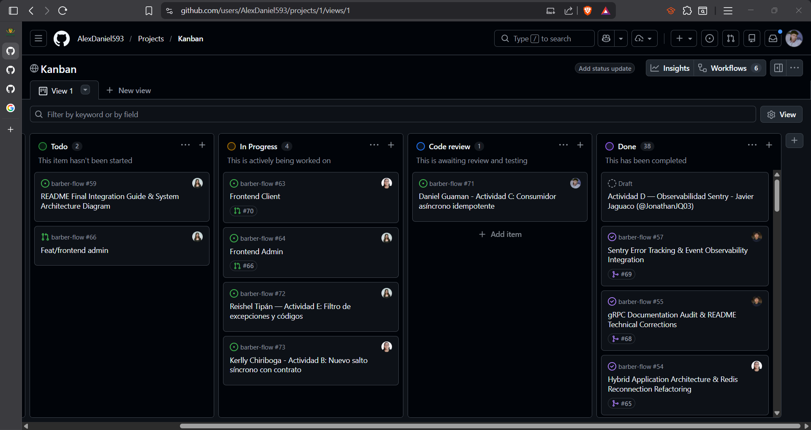
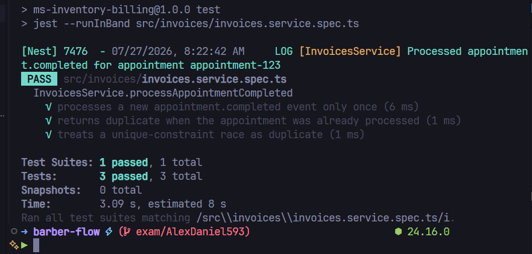

# Bitácora — Examen Final


## 0. Identificación

| | |
|---|---|
| **Nombre** | Daniel Guaman |
| **Usuario GitHub** | @AlexDaniel593 |
| **Grupo / Proyecto** | Barber-flow |
| **Actividad asignada** | C — Consumidor asíncrono idempotente |
| **Rama** | `exam/AlexDaniel593` |
| **Tag** | `examen-AlexDaniel593` |
| **Pull Request** | *(enlace)* |
| **Tarjeta Kanban** | [issues](https://github.com/AlexDaniel593/barber-flow/issues/71) [kanban](https://github.com/users/AlexDaniel593/projects/1/views/1) |
| **¿Hiciste el Paso 0?** | Sí — `apps\inventory-billing\src\events\appointment-events.service.ts` |

Evidencia Kanban


---

## 1. Qué construí


Implementé un flujo idempotente para el evento `appointment.completed` en `inventory-billing`. El consumidor Redis ahora solo delega el evento al servicio de facturas, y la lógica real vive en una transacción que primero revisa si la cita ya fue procesada. Si el evento ya existe o la factura ya fue creada, se trata como duplicado y no se repiten consumos ni cobros. Si es nuevo, se guarda la marca de procesado, se consume inventario y se crea la factura en la misma unidad de trabajo. Además, `appointmentId` sigue siendo único en la tabla de facturas como segunda barrera.


---

## 2. Anclaje con el repositorio de mi grupo — **obligatorio (C2)**


| Código preexistente | Archivo:línea | Cómo me conecto con él |
|---|---|---|
| Consumidor Redis de `appointment.completed` | [apps/inventory-billing/src/events/appointment-events.service.ts](../../../apps/inventory-billing/src/events/appointment-events.service.ts#L73) | Ahí entra el evento real; ahora solo delega al servicio transaccional de facturas. |
| Procesamiento transaccional e idempotente | [apps/inventory-billing/src/invoices/invoices.service.ts](../../../apps/inventory-billing/src/invoices/invoices.service.ts#L84) | Aquí quedó la deduplicación, el consumo de inventario y la creación de la factura dentro de una sola transacción. |
| Registro persistente de eventos procesados | [apps/inventory-billing/src/invoices/entities/processed-event.entity.ts](../../../apps/inventory-billing/src/invoices/entities/processed-event.entity.ts#L3) | Esta tabla guarda la clave procesada con unicidad para bloquear reintentos y duplicados. |

**¿Qué convención del repositorio seguí para que mi código no desentone?**

Seguí la estructura Nest del proyecto: módulo, servicio, controlador y entidades separadas por dominio. También respeté el patrón de logs con `Logger`, captura de errores con `try/catch` y el uso de `TypeOrmModule.forFeature(...)` para registrar entidades del dominio. No metí la lógica de negocio en el controlador; dejé el consumo en `events/` y la decisión de negocio en `invoices/`, que es como ya está organizado el repositorio.


**¿Qué NO dupliqué, pudiendo hacerlo?**

No dupliqué el flujo de facturación dentro del consumidor de Redis: el handler ahora solo delega y no repite la lógica de cálculo, validación o persistencia. Tampoco creé un publisher nuevo para resolver la idempotencia desde el origen, porque el problema real ocurre en el consumidor con entrega "al menos una vez". Y no separé la clave procesada en una tabla externa al dominio; la dejé junto a facturas porque el caso de uso pertenece a `inventory-billing`.


---

## 3. Decisiones técnicas

### Decisión 1
- **Qué decidí:** Llevar toda la lógica de `appointment.completed` a una transacción dentro de `InvoicesService`.
- **Alternativa que descarté:** Dejar el cálculo de factura en el consumidor y solo agregar un `if` previo para consultar duplicados.
- **Por qué:** Un simple `if` no cierra la ventana de carrera; la transacción sí permite que la clave procesada, el consumo de inventario y la factura queden coordinados.

### Decisión 2
- **Qué decidí:** Persistir la clave procesada en PostgreSQL con unicidad sobre `eventKey`, usando `appointmentId` como clave efectiva para este flujo.
- **Alternativa que descarté:** Guardar los procesados en memoria o en Redis temporal.
- **Por qué:** La memoria se pierde al reiniciar el servicio y Redis temporal no garantiza la misma durabilidad ni el mismo anclaje al modelo de datos del dominio.

---

## 4. Las 3 preguntas de mi actividad

**Pregunta 1:**
1. ¿Por qué la garantía "al menos una vez" obliga a que la idempotencia viva en el **consumidor** y no en el publisher?

Porque el broker puede entregar el mismo mensaje más de una vez aunque el publisher solo lo haya emitido una vez. El consumidor es el único que ve la repetición y el único que conoce el punto exacto donde se aplica el efecto real. En mi implementación, eso queda en `InvoicesService.processAppointmentCompleted()`, no en quien publica `appointment.completed`.


**Pregunta 2:**
2. ¿Dónde guardas la clave procesada, y qué ocurre si el proceso muere **entre** aplicar el efecto y guardar la clave? ¿Qué harías para cerrar esa ventana?

La clave queda guardada en la tabla `processed_events`, definida en [apps/inventory-billing/src/invoices/entities/processed-event.entity.ts](../../../apps/inventory-billing/src/invoices/entities/processed-event.entity.ts#L3). En la versión implementada, la marca de procesado, el consumo de inventario y la factura se ejecutan dentro de una transacción; si algo falla, todo se revierte. Así se cierra la ventana entre efecto y persistencia, porque no hay un efecto visible fuera de la transacción si no se pudo confirmar el conjunto completo.


**Pregunta 3:**
3. ¿Qué diferencia hay entre **reintentar** un mensaje y mandarlo a una **cola de mensajes muertos (DLQ)**? ¿Cuándo conviene cada uno?

Reintentar significa volver a procesar un mensaje porque el fallo puede ser temporal, como una dependencia caída o un timeout. Una DLQ se usa cuando el mensaje ya demostró que es inválido o no recuperable, por ejemplo un payload corrupto o una regla de negocio imposible de cumplir. En este caso, conviene reintentar si falla temporalmente la validación o la base de datos; conviene DLQ si el mensaje está mal formado o si el evento no puede corregirse repitiéndolo.

---

## 5. Uso de Inteligencia Artificial — **obligatorio**

**¿Usaste IA en este examen?**  [x] Sí [ ] No

> Usarla no penaliza. **No declararla anula este criterio completo (C5 = 0).**
> Si marcaste "No", firma igualmente la declaración del final.

| # | Qué le pedí | Qué me devolvió | Qué corregí, adapté o descarté — y por qué |
|:--:|---|---|---|
| 1 | Que analizara el flujo de `inventory-billing` y propusiera una solución idempotente. | Me identificó el consumidor Redis y la posibilidad de usar una clave persistida. | Lo adapté a una solución transaccional real, no solo a un filtro previo. |
| 2 | Que conectara la propuesta con el código existente del repositorio. | Me devolvió referencias a módulos, servicios y entidades. | Corregí las rutas para apuntar a `apps/inventory-billing/...` y a la unicidad real de `appointmentId`. |
| 3 | Que redactara la propuesta en forma de bitácora. | Me dio una base estructurada por secciones. | La ajusté al tono del examen y añadí respuestas aterrizadas en mi implementación. |

**¿En qué se equivocó respecto a mi repositorio?**

Asumió primero que el punto principal estaba en el consumidor de RabbitMQ, pero al revisar el repositorio vi que la creación de facturas para `appointment.completed` entra por Redis en `apps/inventory-billing/src/events/appointment-events.service.ts`. También podía sugerir una solución demasiado genérica con un `eventId` inventado, cuando en este proyecto ya existe una clave útil y verificable: `appointmentId` en `Invoice`, además de la tabla `processed_events` que agregué para persistir el procesado. Detecté eso leyendo los archivos reales del dominio y confirmando el flujo factura-consumo.


---

## 6. Evidencia

| Archivo | Qué demuestra |
|---|---|
| `antes-evento-duplicado.png` | Estado previo sin deduplicación o con doble efecto. |
| `despues-evento-duplicado.png` | Estado posterior donde el evento duplicado se descarta y no vuelve a facturar. |
| `apps/inventory-billing/src/invoices/invoices.service.spec.ts` | Prueba automatizada del flujo idempotente de `appointment.completed`. |
| `BITACORA.md` | Documento de trazabilidad del trabajo realizado. |

**Cómo reproducir mi cambio desde cero:**

```bash
docker compose up -d --build

npm --prefix apps/inventory-billing test -- --runInBand src/invoices/invoices.service.spec.ts
```

---

## 7. Prueba automatizada

| | |
|---|---|
| **Archivo de la prueba** | [apps/inventory-billing/src/invoices/invoices.service.spec.ts](../../../apps/inventory-billing/src/invoices/invoices.service.spec.ts#L99) |
| **Comando para ejecutarla** | `npm test -- --runInBand src/invoices/invoices.service.spec.ts` |
| **Qué verifica** | Que dos entregas del mismo evento no generen dos consumos ni dos facturas |
| **¿Falla sin mi cambio?** | Sí — porque antes no existía persistencia de claves procesadas ni transacción idempotente |

*Salida de la prueba pasando:*



```
PASS src/invoices/invoices.service.spec.ts
3 tests passed
```

---

## 8. Estado final — honesto

**Funciona:**
- `appointment.completed` ya pasa por un procesamiento transaccional con deduplicación en base de datos.
- El consumidor Redis quedó delegado y no repite lógica de factura ni de stock.
- Existe una prueba automatizada que cubre el caso normal, el duplicado y la carrera por restricción única.

**No funciona / quedó incompleto:**
- Falta una prueba e2e que dispare el evento real por Redis y valide el comportamiento contra servicios levantados.

**Cuál era mi siguiente paso:**

Si se requiere mayor cobertura, agregar una prueba de integración que ejecute el consumidor real con Redis y Postgres.

---

## 9. Declaración

> Declaro que este trabajo es individual, que corresponde a la actividad que me fue asignada, y que la sección 5 refleja de forma completa y veraz el uso que hice de herramientas de Inteligencia Artificial durante el examen.

**Nombre: Daniel Guaman**
**Fecha: 27/07/2026**
