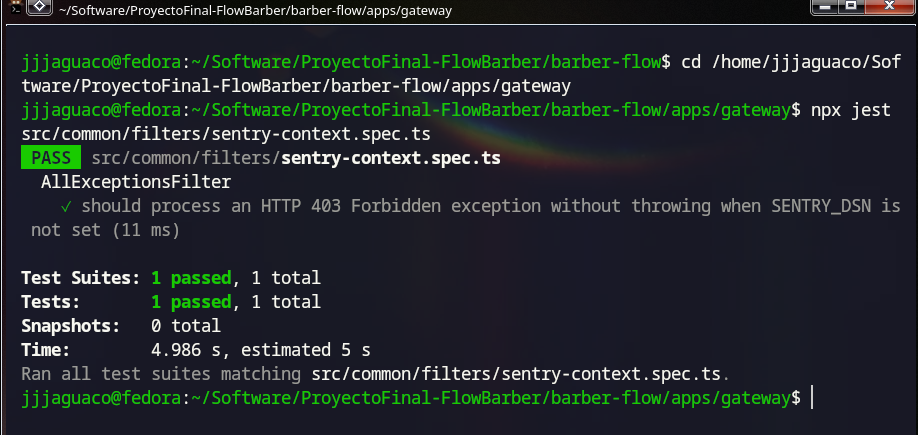
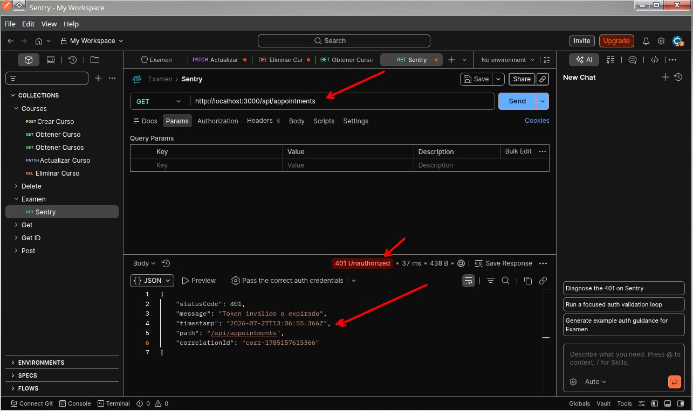
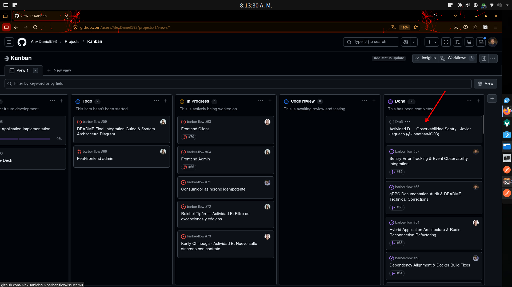
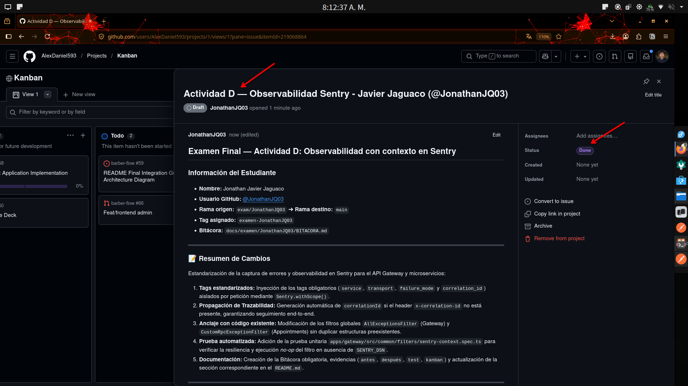

# Bitácora — Examen Final

## 0. Identificación

| | |
|---|---|
| **Nombre** | Jonathan Javier Jaguaco Quituisaca|
| **Usuario GitHub** | @JonathanJQ03 |
| **Grupo / Proyecto** | Grupo 2 / Barber-Flow |
| **Actividad asignada** | Actividad D — Observabilidad con contexto en un microservicio |
| **Rama** | `exam/JonathanJQ03` |
| **Tag** | `examen-JonathanJQ03` |
| **Pull Request** | [#74](https://github.com/AlexDaniel593/barber-flow/pull/74) |
| **Tarjeta Kanban** | Estado `Done` (registrada en tablero de GitHub Projects) |
| **¿Hiciste el Paso 0?** | No, ya que el repositorio contaba con la base de Sentry realizada en el Avance 3 en `apps/gateway/src/main.ts` |

---

## 1. Qué construí

Se estandarizó la convención para la captura de la observabilidad en Sentry para el API Gateway y los microservicios, estructurando la solución de la siguiente manera:

* **Tags obligatorios:** Inyección estandarizada de los tags `service`, `transport`, `failure_mode` y `correlation_id` en todos los eventos de error capturados.
* **Trazabilidad de peticiones:** Propagación end-to-end mediante el encabezado `x-correlation-id`, con generación de un identificador dinámico de respaldo (*fallback*) cuando la cabecera no está presente.
* **Aislamiento de contexto:** Uso de `Sentry.withScope()` por solicitud para evitar la contaminación de metadatos entre peticiones concurrentes en Node.js y registrar *breadcrumbs* de navegación previa.
* **Seguridad y privacidad (PII):** Filtrado explícito para evitar la fuga de datos sensibles (contraseñas, tokens JWT o *bodies* completos), limitando la captura a metadatos seguros (`method`, `url`, `status`, `correlationId`).
* **Resiliencia (Modo No-Op):** Operación transparente de los filtros de excepciones en entornos locales o de desarrollo sin interrumpir el arranque del servicio cuando `SENTRY_DSN` no está configurado.

---

## 2. Anclaje con el repositorio de mi grupo — **obligatorio (C2)**

| Código preexistente | Archivo:línea | Cómo me conecto con él |
|---|---|---|
| `AllExceptionsFilter` | `apps/gateway/src/common/filters/all-exceptions.filter.ts:1` | Modifiqué el filtro global HTTP preexistente para inyectar tags y contextos de Sentry de forma estandarizada sin alterar la estructura previa. |
| `CustomRpcExceptionFilter` | `apps/appointments/src/common/filters/rpc-exception.filter.ts:1` | Homologué los tags de captura para el transporte TCP dentro del microservicio de citas. |
| Bootstrap de Sentry | `apps/gateway/src/main.ts:15` | Me conecté a la inicialización de Sentry preexistente en el punto de entrada del API Gateway. |

* **¿Qué convención del repositorio seguí para que mi código no desentone?**  
  Seguí la arquitectura de filtros globales de NestJS utilizando el decorador `@Catch()`, la inyección del `Logger` nativo del framework y la gestión de scope por solicitud con `Sentry.withScope()`.

* **¿Qué NO dupliqué, pudiendo hacerlo?**  
  No creé un nuevo filtro ni un middleware paralelo para Sentry. Usé directamente los filtros globales `AllExceptionsFilter` y `CustomRpcExceptionFilter` que mi grupo ya utilizaba para centralizar todas las excepciones de la aplicación.

---

## 3. Decisiones técnicas

### Decisión 1
- **Qué decidí:** Utilizar `Sentry.withScope()` para aislar los tags y el contexto por cada petición de forma efímera.
- **Alternativa que descarté:** Usar `Sentry.setTag()` o `Sentry.configureScope()` de forma global en la instancia de Sentry.
- **Por qué:** En el entorno asíncrono y concurrente de Node.js, modificar tags de forma global contamina el contexto entre peticiones simultáneas de distintos usuarios. `Sentry.withScope()` asegura que los metadatos pertenezcan exclusivamente al ciclo de vida del evento actual.

### Decisión 2
- **Qué decidí:** Generar un identificador dinámico de respaldo (`corr-${Date.now()}`) cuando la cabecera `x-correlation-id` no está presente en la solicitud HTTP.
- **Alternativa que descarté:** Omitir el tag `correlation_id` o dejarlo como valor `null` / `undefined` cuando la petición carece de la cabecera.
- **Por qué:** Garantiza una trazabilidad uniforme del 100% en Sentry. Permite agrupar y rastrear fallas incluso en peticiones externas o de clientes que no envían el encabezado explícitamente.

---

## 4. Las 3 preguntas de mi actividad

**Pregunta 1: ¿Por qué la inicialización debe ser no-op cuando no hay DSN en vez de fallar al arrancar?**
> Porque la observabilidad es un mecanismo de soporte y no un requisito funcional bloqueante. Si el servicio fallara al arrancar por la ausencia de DSN, impediría la ejecución del sistema en entornos locales, de pruebas o de desarrollo fuera de línea donde Sentry no es requerido.

**Pregunta 2: ¿Qué información nunca debe llegar a Sentry desde un sistema con datos de usuarios, y qué hiciste concretamente para impedirlo?**
> Nunca deben llegar datos sensibles como contraseñas, tokens JWT, tarjetas de crédito o información personal de los usuarios (PII). Para evitarlo, dejé fuera del reporte el cuerpo de la petición (body) y las cabeceras de autenticación (Authorization), enviando únicamente metadatos seguros como el método HTTP, la URL, el código de estado y el correlationId.

**Pregunta 3: ¿Qué diferencia hay entre un tag y un contexto en Sentry, y por qué elegiste precisamente esos tags?**
> Un tag es una etiqueta indexada que nos permite buscar, filtrar y agrupar errores fácilmente en el panel de Sentry. Un contexto es información detallada sobre el estado del error que sirve para analizarlo a fondo, pero que no permite hacer búsquedas. Elegí service, transport, failure_mode y correlation_id porque me permiten identificar al instante en qué microservicio ocurrió la falla, bajo qué protocolo, qué tipo de error fue y seguirle el rastro a la petición.

---

## 5. Uso de Inteligencia Artificial — **obligatorio**

**¿Usaste IA en este examen?**  ☑ Sí  ☐ No

> **Entorno y herramientas utilizadas:** OpenCode utilizando el modelo DeepSeek (v3 / Flash).

Para esta actividad utilicé herramientas de IA como un co-piloto de apoyo enfocado en agilizar el prototipado de código base (*boilerplate*) y consultar sintaxis específica del SDK de Sentry. Toda la integración arquitectónica, la adaptación a los patrones del repositorio y la validación final del código se realizaron de forma manual para garantizar la coherencia con el proyecto `barber-flow`.

| # | Qué le pedí | Qué me devolvió | Qué corregí, adapté o descarté — y por qué |
|:--:|---|---|---|
| 1 | Estructura para inyectar tags y contextos de Sentry aislándolos por petición en NestJS. | Un bloque de código genérico aplicando la sintaxis de `Sentry.withScope()` y una estructura de error estándar. | **Adapté el formato al contrato existente:** Reestructuré la respuesta propuesta para no alterar el JSON que nuestro Gateway ya retornaba (`statusCode`, `message`, `timestamp`, `path`, `correlationId`). Además, aseguré de forma explícita la exclusión de payloads o cabeceras sensibles. |
| 2 | Propuesta de un test unitario en Jest para validar que el filtro funcione en modo *no-op* sin `SENTRY_DSN`. | Una suite de prueba compleja que intentaba compilar el módulo completo mediante el paquete `@nestjs/testing`. | **Refactoricé y simplifiqué la prueba:** Descarté el uso de `@nestjs/testing` para evitar un test pesado o frágil. En su lugar, instancié directamente la clase del filtro y construí un mock liviano del objeto `ArgumentsHost`, logrando una prueba unitaria pura, rápida y mantenible. |

**¿En qué se equivocó respecto a mi repositorio?**
> La IA generó código asumiendo una arquitectura de microservicios genérica basada en protocolo **gRPC**. Al revisar la configuración real de nuestro proyecto `barber-flow`, identifiqué que el microservicio de citas (`Appointments`) utiliza transporte **TCP** para comunicarse con el API Gateway. Corregí manualmente el tag `transport` asignándole el valor `'tcp'` en `rpc-exception.filter.ts`, asegurando que las métricas registradas en Sentry reflejen con exactitud el protocolo de red de nuestro sistema.

---

## 6. Evidencia

| Archivo | Qué demuestra |
|---|---|
| `antes-tags-incompletos.txt` | Estado previo donde la captura no incluía la convención completa de tags ni trazabilidad. |
| `despues-tags-completos.txt` | Estado posterior mostrando la presencia de `service`, `transport`, `failure_mode` y `correlation_id`. |
| `01-test-pass.png` | Ejecución de la prueba unitaria en Jest pasando en verde sin DSN. |
| `02-sentry-tags.png` | Respuesta HTTP en Postman con error inyectando `correlationId`. |
| `03-kanban.png` | Tarjeta del examen en la columna 'Hecho' dentro del Kanban. |
| `03-kanban-descripcion.png` | Detalle de la tarjeta Kanban con enlace al Pull Request. |

### Capturas Visuales






**Cómo reproducir mi cambio desde cero:**

```bash
# 1. Navegar al API Gateway y ejecutar la prueba automatizada
cd apps/gateway
npx jest src/common/filters/sentry-context.spec.ts
```
## 7. Prueba automatizada

| Archivo de la prueba | `apps/gateway/src/common/filters/sentry-context.spec.ts` |
|---|---|
| Comando para ejecutarla | `npx jest src/common/filters/sentry-context.spec.ts` (dentro de `apps/gateway`) |
| Qué verifica | Que `AllExceptionsFilter` procese correctamente las excepciones sin fallar cuando `SENTRY_DSN` no está configurado. |
| ¿Falla sin mi cambio? | Sí, no existía el archivo de prueba unitaria para validar la captura aislada del contexto de Sentry. |

```
PASS  src/common/filters/sentry-context.spec.ts
  AllExceptionsFilter
    ✓ should process an HTTP 403 Forbidden exception without throwing when SENTRY_DSN is not set
```

## 8. Estado final — honesto

**Funciona:**
- Captura de excepciones en Gateway con tags estandarizados.
- Propagación de `correlation_id` en contextos.
- Prueba automatizada Jest pasando.

**No funciona / quedó incompleto:**
- Ninguno, la estandarización y test de la variante D se completaron al 100%.

## 9. Declaración

Declaro que este trabajo es individual, que corresponde a la actividad que me fue asignada, y que la sección 5 refleja de forma completa y veraz el uso que hice de herramientas de Inteligencia Artificial durante el examen.

**Nombre:** Jonathan Javier Jaguaco Quituisaca
**Fecha:** 27 de julio de 2026
